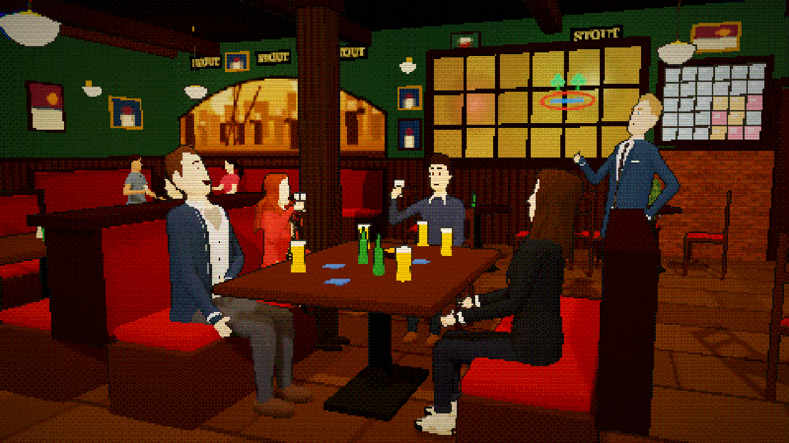

# how i met your slop

A *How I Met Your Mother*–style sitcom that plays in the browser. Low-poly puppets act out episodes that AI
agents wrote ahead of time. Everything is procedural: the characters, sets, music and laugh track. Voices use
the browser's speech synthesis.



## Run it

```sh
bun install
bun dev       # http://localhost:5173
```

The page opens on a TV guide. Pick an episode and the show plays on its own. Press `d` for dev mode, which
adds playback controls, a transcript and a playground for testing characters, sets and beats.

URL options: `?ep=S11E01` starts an episode, `?dev` opens dev mode, `?mute` plays silently, and
`?set=maclarens` opens a set tour.

## Episodes

Each episode is a JSON file in `episodes/`. The app bundles them at build time. Agents write them with the
`/write-episodes` skill and the `episode-writer` agent in `.claude/`.

```sh
bun run bible             # characters, sets, stage directions and the file format
bun run episodes check    # validate episodes
bun test                  # all tests, including every episode
```

## Code

| Path | What it holds |
| --- | --- |
| `src/script/` | Episode format, show bible, validator |
| `src/show/` | Player, director (camera), stage, transitions, titles and credits |
| `src/world/` | Characters, faces, gestures, props and sets |
| `src/engine/` | Three.js renderer and the pixel/dither picture style |
| `src/audio/` | Synthesized music, laughs and sound effects, plus speech |
| `src/ui/` | TV guide, overlays, dev panel, playground, set tour |
| `scripts/` | Episode tools and the README screenshot |
| `docs/` | Research and visual references from the original show |

`bun run screenshot` regenerates the image above.
