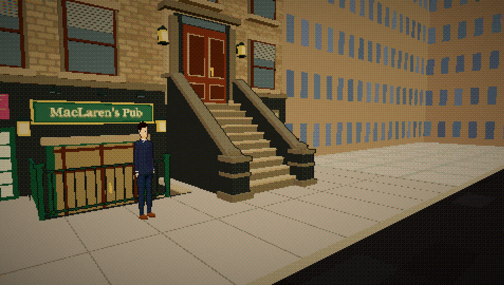
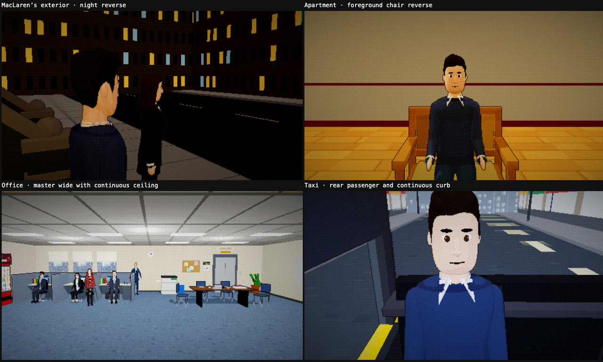
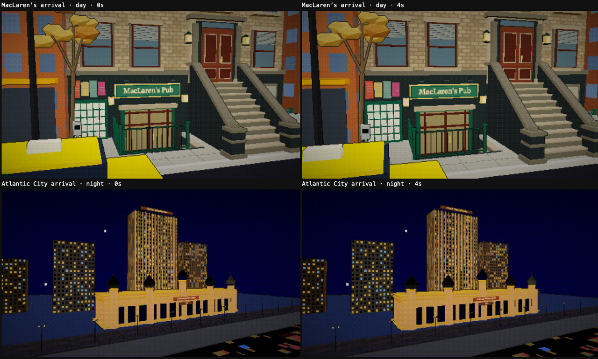

# Camera audit

The MacLaren’s sidewalk backdrop had gaps between its flat building panels. Oblique and reverse views could see sky through those gaps down to street level. The panels now overlap at each corner.

The full set review also found and fixed:

- Ceiling and wall edges in the shared room shell and the office master view. The shell now extends behind the camera.
- Exposed window-backdrop edges in Barney’s office. The skyline panel now covers oblique views through the blinds.
- Slits below the raised sidewalks in vehicle window views. The sidewalks now have solid curbs.
- Missing reverse backgrounds for the future storytelling mark. An interior-facing fourth wall provides face coverage while keeping the master view open.
- The apartment has no fourth wall. Its audience side is open for the cameras, as on the real stage, so `openSide` makes the director reject any angle that looks out through it. People in the upstage-facing front chairs get profile singles instead of reverses.
- Close-ups near walls that fell back to distant coverage. Additional profile candidates and checks across the whole frame keep suitable singles available without exposing scenery edges.

## Review coverage

Reviewed the running app with `mute` enabled at its 16:9 picture aspect ratio:

- All 25 sets in day and night lighting.
- All 88 authored wide shots and singles at all 265 staging marks.
- Representative two-shots and over-the-shoulder shots in both directions for every set.
- Exterior arrivals for every location at the beginning and end of their moves, plus day/night skyline views at 0, 2 and 4 seconds.

Automated checks independently sample the full picture for every wide and staging-mark single, with denser checks for the MacLaren’s seams. Existing staging tests check speaker visibility across every pair of marks. Establishing coverage checks sample the frame at 0, 2 and 4 seconds in both lighting states.

## Validation

- `bun test`: 692 passed, 0 failed.
- `bun run build`: passed.
- `bun run episodes check`: 56 episodes, 0 errors, 5 existing writing warnings.

## Running-app screenshots

