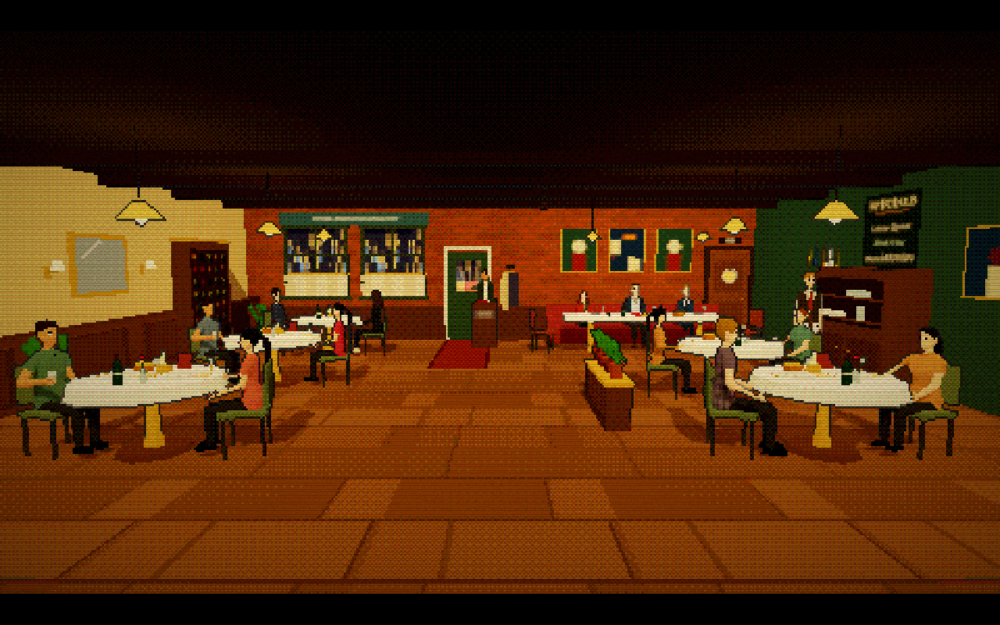
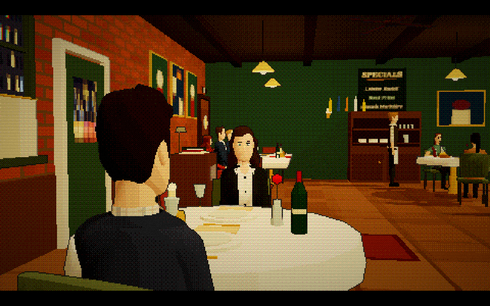

# Restaurant dining room

The restaurant now has five two-tops alongside the group banquette, with eight seated background diners, a host, and a waiter. Diners chat with their table partners and yield their seats when the cast uses the same marks. Bread baskets, folded menus, pendant lamps, framed art, and a low planted divider fill out the dining area.

The central aisle, entrance, and service route remain clear. The date-table and banquette cameras sit ahead of the neighboring tables so patrons do not block the cast.

Open `/?set=restaurant&mute` for the silent set tour. Its camera selector includes all three wides, five cast close-ups, two-shots, and both shoulder angles; the lighting button switches between day and night.

## Review

- Reviewed every tour angle in day and night lighting in the running app.
- Reviewed singles at all 20 staging marks, plus two-shots and both shoulder angles at the date table, dining bay, foreground tables, and banquette.
- Restaurant staging and frame checks: 15 passed, including clear furniture approaches and coverage across every pair of marks.
- Simulated entrances and exits with diners and staff present at the aisle and all six added seats.
- Production build passed. Episode validation reported no errors and four existing writing warnings.
- The wider camera checks passed after increasing the default timeout and pausing the browser animation for the apartment audit.

